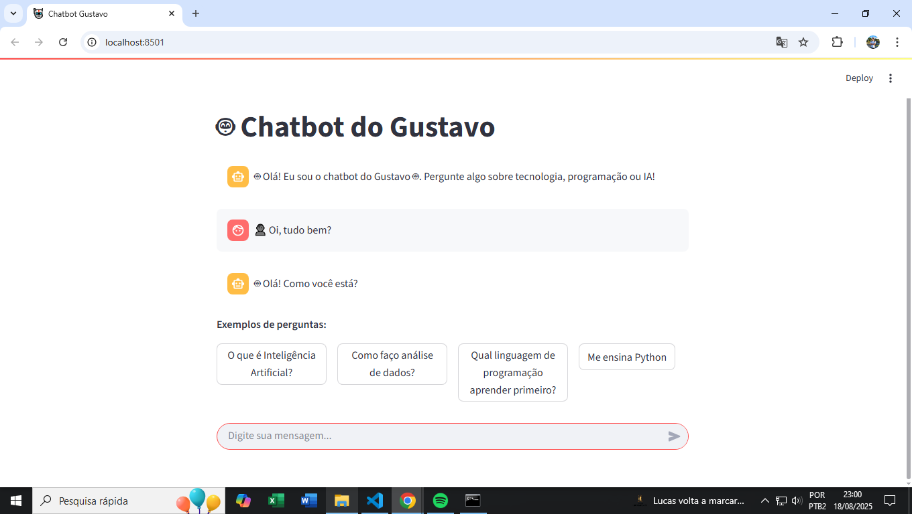
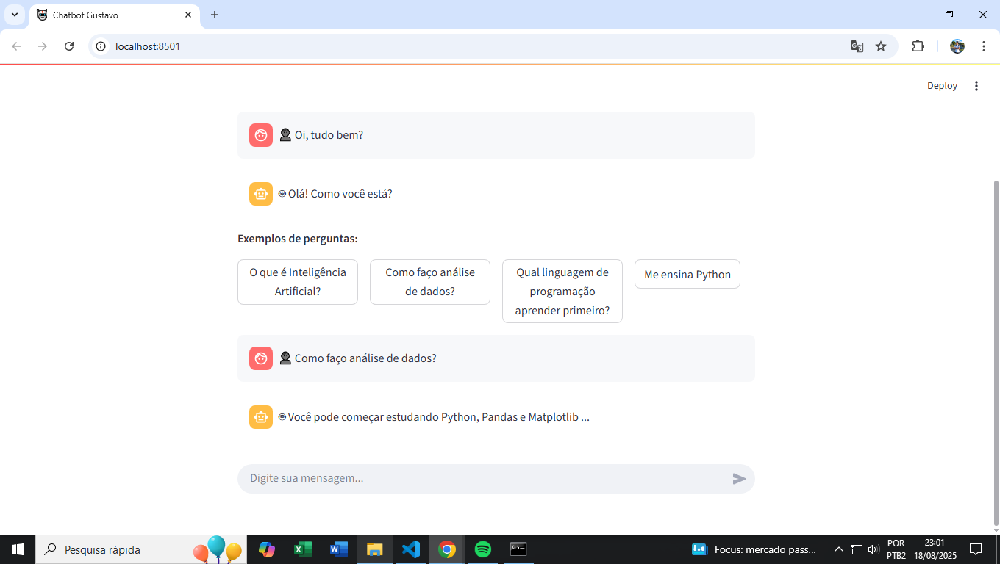

# Chatbot do Gustavo 🤖

Este é um chatbot desenvolvido em Python, utilizando **Machine Learning** para classificar intenções e responder perguntas sobre tecnologia, programação e Inteligência Artificial.

---

## Funcionalidades

- Responde perguntas baseadas em intenções definidas no `intents.json`
- Utiliza **TF-IDF** + **Classificador MultinomialNB** para processamento de linguagem natural
- Interface web interativa via **Streamlit**
- Mostra respostas com confiança mínima

---

## Demonstração

  
*Saudação inicial do chatbot*

  
*Exemplo de interação respondendo perguntas do usuário*

---

## Tecnologias utilizadas

- Python
- Pandas, Numpy
- Scikit-learn
- Streamlit
- Joblib

---

## Como rodar

1. Clone o repositório:
git clone https://github.com/IamRangel/chatbot-ia.git

3. Entre na pasta do projeto:
cd chatbot-ia

3. Crie o ambiente virtual e ative:
python -m venv .venv
.venv\Scripts\activate  

4. Instale as dependências:
pip install -r requirements.txt

5. Rode o chatbot:
streamlit run streamlit_app.py
